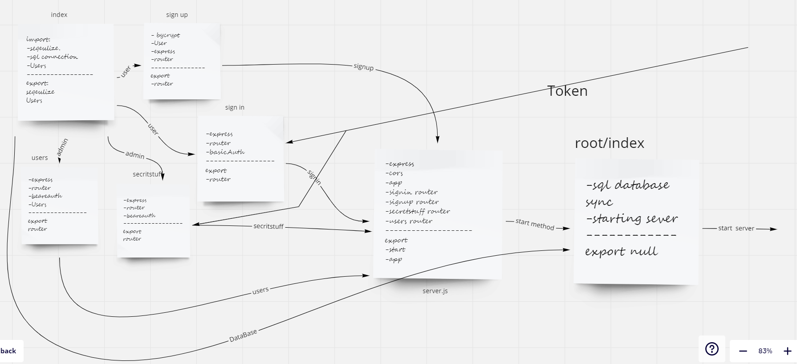

# bearer-auth

## Desicrption 

- Create files for the project.
- import the important packages like sequrlize and express etc.
- create server , root index , router and middlewear.
- create /signin and /signup route /secritstuff/users(for testing).
- Two middleware : BasicAuth ,BeareAuth ,
- and test the routes.

## Path and body
- post/signup
- post/signin
- get/secretstuff
- get/users 
for use router you need to sign in before and git token and go to bearer Auth the same /sectretstuff 

- body{

username take string
password take string 
}

## Link

- [pull request 1](https://github.com/WalidAlrefai/bearer-auth/pull/1)
- [pull request 2](https://github.com/WalidAlrefai/bearer-auth/pull/3) 
- [Action](
https://github.com/WalidAlrefai/bearer-auth/actions)
- [heroku](https://walid-bearer-auth.herokuapp.com/)

## UML

